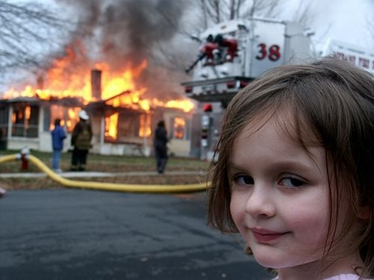
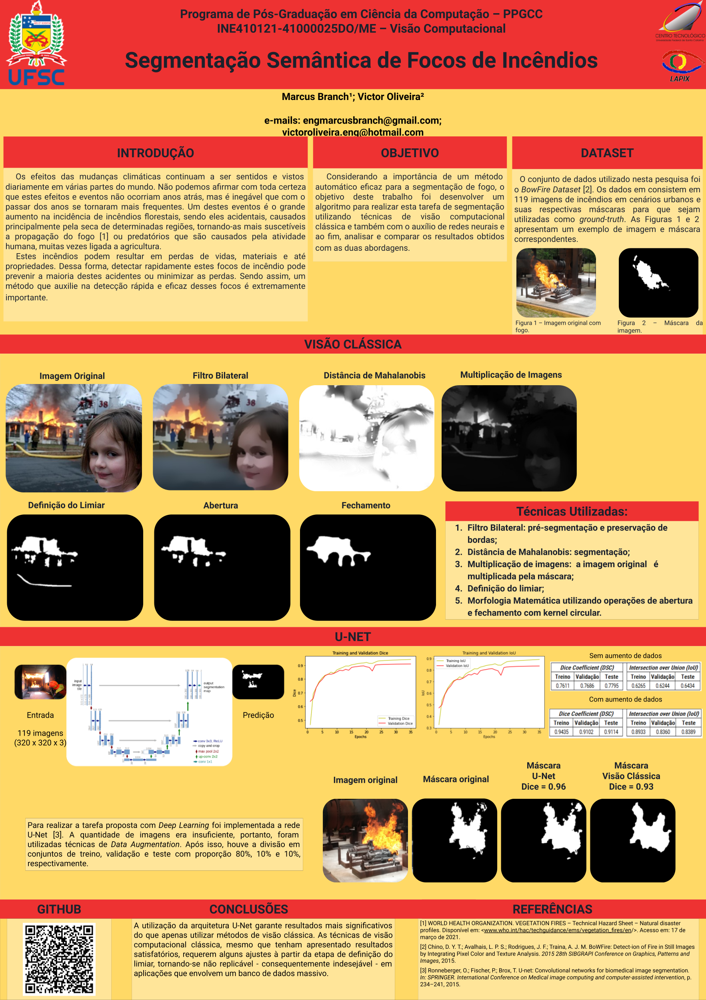

# Fire Detection - Computer Vision

by: Victor Oliveira and Marcus Branch.

<h1 align="center">
  
</h1>

## Poster:

<h1 align="center">
  
</h1>

### :computer: Features

- [x] Classic Computer Vision;

      [x] Bilateral Filter;
      [x] Mahalanobis Distance;
      [x] Limiar Threshold;
      [x] Mathematical Morphology;
- [x] Deep Learning;

      [x] U-Net;

### 🛠 Tools

- [Python](https://www.python.org/)
- [OpenCV](https://opencv.org/)
