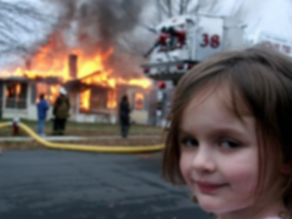
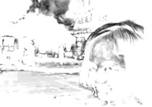
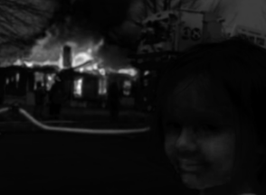
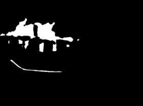
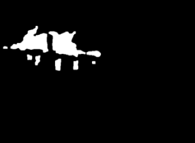
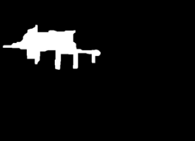

# Fire Detection - Computer Vision

<h1 align="center">
  
</h1>

<h3 align="center"> 
	🚧  🚀 Em construção...  🚧
</h3>

### :computer: Features

- [x] Extração dos dados;
- [x] Implementação da Visão Clássica;

      [x] Mahalanobis Distance;
      [x] Adaptative Threshold;
      [x] Morfologia Matemática;
      [x] SVM;
- [x] Deep Learning;

### 🛠 Tools

- [Python](https://www.python.org/)
- [OpenCV](https://opencv.org/)

## Classic Computer Vision
### Mahalanobis Distance
<h2 align="center">
	
	
</h2>

<h2 align="center">
	
	
</h2>

### Limiar Threshold, Mathematical Morphology and Final Boolean Mask
<h2 align="center">
	
      	
	
</h2>
